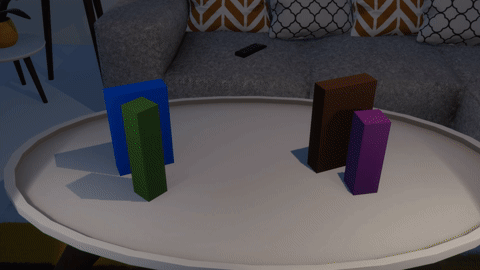
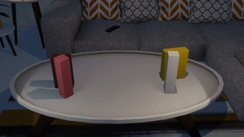

# cloth

**NOTE: If you do not know the answer, choose RANDOMLY!!!!**

**NOTE: Correct choices may be one or more!!**

**There is no need for you to answer all.**

## 350

**00810**

Is the left cloth much harder to bend or have wrinkles than the other?

**00811**

Which phrase below can best describe the final pose of the gray plate?

A. Standing upright.

B. Leaning.

C. Lying horizontally.

**00812**

Does the gray pillar fall over?

A. Yes.

B. No.

----

## 351

**01290**

Is the elasticity of the right cloth much greater than that of the other?

**01291**

Does the white plate collide with the pink pillar?

A. Yes.

B. No.

**01292**

Does the pink pillar finally in touch with the white plate?

A. Yes.

B. No.

----

## 352

**00288**

Is the elasticity of the right cloth much greater than that of the other?

**00289**

Does the gray pillar collide with the blue plate?

A. Yes.

B. No.

**00290**

Does the pink pillar fall over?

A. Yes.

B. No.

----

## 353

**00234**

Is the elasticity of the left cloth much greater than that of the other?

**00235**

Does the purple plate collide with the gray pillar?

A. Yes.

B. No.

**00236**

Does the purple pillar fall over?

A. Yes.

B. No.

----

## 354

**00708**

Is the elasticity of the left cloth much greater than that of the other?

**00709**

Does the cyan pillar fall over?

A. Yes.

B. No.

**00710**

Which phrase below can best describe the final pose of the green plate?

A. Standing upright.

B. Leaning.

C. Lying horizontally.

----

## 355

**01221**

Is the elasticity of the left cloth much less than that of the other?

**01222**

Does the cyan plate fall over?

A. Yes.

B. No.

**01223**

Does the cyan plate finally in touch with the cyan pillar?

A. Yes.

B. No.

----

## 356

**01146**

Is the left cloth much harder to bend or have wrinkles than the other?

**01147**

Which phrase below can best describe the final pose of the cyan pillar?

A. Standing upright.

B. Leaning.

C. Lying horizontally.

**01148**

Does the purple plate collide with the cyan pillar?

A. Yes.

B. No.

----

## 357

**00135**

Is the right cloth much harder to bend or have wrinkles than the other?

**00136**

Does the yellow plate finally in touch with the orange pillar?

A. Yes.

B. No.

**00137**

Does the brown pillar fall over?

A. Yes.

B. No.

----

## 358

**00045**

Is the elasticity of the right cloth much greater than that of the other?

**00046**

Does the green pillar collide with the pink plate?

A. Yes.

B. No.

**00047**

Which phrase below can best describe the final pose of the purple pillar?

A. Standing upright.

B. Leaning.

C. Lying horizontally.

----

## 359

**00555**

Is the right cloth much harder to bend or have wrinkles than the other?

**00556**

Does the gray plate fall over?

A. Yes.

B. No.

**00557**

Does the brown pillar finally in touch with the gray plate?

A. Yes.

B. No.

----

## 360

**00255**

Is the elasticity of the right cloth much greater than that of the other?

**00256**

Does the cyan pillar finally in touch with the green plate?

A. Yes.

B. No.

**00257**

Does the green plate collide with the cyan pillar?

A. Yes.

B. No.

----

## 361

**00741**

Is the left cloth much harder to bend or have wrinkles than the other?

**00742**

Which phrase below can best describe the final pose of the gray pillar?

A. Standing upright.

B. Leaning.

C. Lying horizontally.

**00743**

Does the cyan plate fall over?

A. Yes.

B. No.

----

## 362

**01245**

Is the elasticity of the right cloth much less than that of the other?

**01246**

Does the brown plate fall over?

A. Yes.

B. No.

**01247**

Does the blue plate finally in touch with the green pillar?

A. Yes.

B. No.

----

## 363

**01185**

Is the elasticity of the right cloth much greater than that of the other?

**01186**

Which phrase below can best describe the final pose of the pink plate?

A. Standing upright.

B. Leaning.

C. Lying horizontally.

**01187**

Does the white pillar fall over?

A. Yes.

B. No.

----

## 364

**00180**

Is the right cloth much easier to bend or have wrinkles than the other?

**00181**

Does the gray plate finally in touch with the gray pillar?

A. Yes.

B. No.

**00182**

Does the gray plate fall over?

A. Yes.

B. No.

----

## 365

**00666**

Is the elasticity of the left cloth much greater than that of the other?

**00667**

Which phrase below can best describe the final pose of the cyan pillar?

A. Standing upright.

B. Leaning.

C. Lying horizontally.

**00668**

Does the purple pillar collide with the cyan plate?

A. Yes.

B. No.

----

## 366

**00579**

Is the elasticity of the left cloth much greater than that of the other?

**00580**

Does the blue plate fall over?

A. Yes.

B. No.

**00581**

Which phrase below can best describe the final pose of the blue plate?

A. Standing upright.

B. Leaning.

C. Lying horizontally.

----

## 367

**01080**

Is the left cloth much easier to bend or have wrinkles than the other?

**01081**

Does the yellow pillar fall over?

A. Yes.

B. No.

**01082**

Does the pink pillar collide with the green plate?

A. Yes.

B. No.

----

## 368

**01029**

Is the right cloth much easier to bend or have wrinkles than the other?

**01030**

Does the cyan pillar fall over?

A. Yes.

B. No.

**01031**

Does the orange plate finally in touch with the blue pillar?

A. Yes.

B. No.

----

## 369

**01497**

Is the left cloth much easier to bend or have wrinkles than the other?

**01498**

Does the cyan pillar collide with the brown plate?

A. Yes.

B. No.

**01499**

Does the cyan pillar fall over?

A. Yes.

B. No.

----

## 370

**01212**

Is the elasticity of the right cloth much greater than that of the other?

**01213**

Does the white plate collide with the yellow pillar?

A. Yes.

B. No.

**01214**

Which phrase below can best describe the final pose of the yellow pillar?

A. Standing upright.

B. Leaning.

C. Lying horizontally.

----

## 371

**00216**

Is the right cloth much harder to bend or have wrinkles than the other?

**00217**

Which phrase below can best describe the final pose of the green plate?

A. Standing upright.

B. Leaning.

C. Lying horizontally.

**00218**

Does the brown plate collide with the white pillar?

A. Yes.

B. No.

----

## 372

**00693**

Is the right cloth much easier to bend or have wrinkles than the other?

**00694**

Which phrase below can best describe the final pose of the orange plate?

A. Standing upright.

B. Leaning.

C. Lying horizontally.

**00695**

Does the cyan pillar collide with the orange plate?

A. Yes.

B. No.

----

## 373

**00624**

Is the left cloth much easier to bend or have wrinkles than the other?

**00625**

Does the blue pillar collide with the orange plate?

A. Yes.

B. No.

**00626**

Does the blue pillar finally in touch with the orange plate?

A. Yes.

B. No.

----

## 374

**01116**

Is the elasticity of the right cloth much greater than that of the other?

**01117**

Which phrase below can best describe the final pose of the brown plate?

A. Standing upright.

B. Leaning.

C. Lying horizontally.

**01118**

Does the yellow pillar fall over?

A. Yes.

B. No.

----

## 375

**00111**

Is the left cloth much easier to bend or have wrinkles than the other?

**00112**

Does the purple plate finally in touch with the gray pillar?

A. Yes.

B. No.

**00113**

Which phrase below can best describe the final pose of the brown pillar?

A. Standing upright.

B. Leaning.

C. Lying horizontally.

----

## 376

**00027**

Is the elasticity of the left cloth much less than that of the other?

**00028**

Does the yellow pillar collide with the cyan plate?

A. Yes.

B. No.

**00029**

Does the cyan plate finally in touch with the yellow pillar?

A. Yes.

B. No.

----

## 377

**00534**

Is the left cloth much easier to bend or have wrinkles than the other?

**00535**

Does the cyan plate fall over?

A. Yes.

B. No.

**00536**

Does the blue pillar collide with the cyan plate?

A. Yes.

B. No.

----

## 378

**00459**

Is the left cloth much easier to bend or have wrinkles than the other?

**00460**

Does the green pillar finally in touch with the green plate?

A. Yes.

B. No.

**00461**

Does the green plate fall over?

A. Yes.

B. No.

----

## 379

**00981**

Is the elasticity of the right cloth much greater than that of the other?

**00982**

Which phrase below can best describe the final pose of the pink pillar?

A. Standing upright.

B. Leaning.

C. Lying horizontally.

**00983**

Does the yellow plate finally in touch with the white pillar?

A. Yes.

B. No.

----

