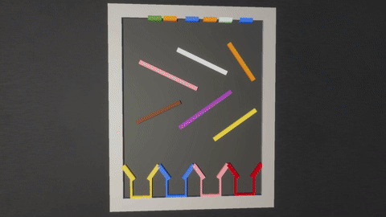

# fluid

**NOTE: If you do not know the answer, choose RANDOMLY!!!!**

**NOTE: Correct choices may be one or more!!**

**There is no need for you to answer all.**

## 350

**00810**

How many sticks are there in the video?

**00811**

Which stick will the fluid from the other orange emitter pass?
A. Purple stick
B. Gray stick
C. Brown stick

**00812**

If the gray stick were removed, which stick would orange fluid pass?
A. Pink stick
B. Brown stick
C. Cyan stick

----

## 351

**01290**

Is the density of light blue fluid equal to that of green fluid?

**01291**

If the pink stick were removed, which container would light blue fluid flow into?
A. Green container
B. Blue container
C. Pink container
D. Brown container

**01292**

If the green stick were removed, which stick would blue fluid pass?
A. Yellow stick
B. Black stick
C. Orange stick

----

## 352

**00288**

Is the density of cyan fluid larger than that of yellow fluid?

**00289**

Which stick will the fluid from the other yellow emitter pass?
A. Green stick
B. White stick
C. Black stick

**00290**

If the white stick were removed, which container would cyan fluid flow into?
A. Green container
B. Pink container
C. Blue container
D. Orange container

----

## 353

**00234**

How many sticks are there in the video?

**00235**

If the white stick were removed, which stick would yellow fluid pass?
A. Purple stick
B. Gray stick
C. Yellow stick
D. Orange stick
E. White stick

**00236**

What can we do to let most of the cyan fluid enter brown container?
A. Remove yellow stick
B. Remove purple stick
C. Remove orange stick

----

## 354

**00708**

How many sticks are there in the video?

**00709**

Which container will the fluid from the other light blue emitter flow into?
A. Purple container
B. Gray container
C. Black container

**00710**

What can we do to let most of the light blue fluid enter black container?
A. Remove cyan stick
B. Remove yellow stick
C. Remove pink stick
D. Remove orange stick

----

## 355

**01221**

How many sticks are there in the video?

**01222**

If the black stick were removed, which stick would cyan fluid pass?
A. Purple stick
B. Black stick
C. Brown stick
D. Orange stick
E. White stick

**01223**

Which container will the fluid from the other blue emitter flow into?
A. Green container
B. Pink container
C. Gray container

----

## 356

**01146**

How many sticks are there in the video?

**01147**

If the purple stick were removed, which stick would blue fluid pass?
A. Yellow stick
B. Brown stick
C. White stick
D. Orange stick
E. Pink stick

**01148**

Which stick will the fluid from the other blue emitter pass?
A. Orange stick
B. Yellow stick
C. Brown stick
D. Purple stick

----

## 357

**00135**

How many sticks are there in the video?

**00136**

If the gray stick were removed, which container would cyan fluid flow into?
A. White container
B. Cyan container
C. Red container

**00137**

What can we do to let most of the green fluid enter white container?
A. Remove green stick
B. Remove gray stick
C. Remove white stick

----

## 358

**00045**

Is the density of light blue fluid greater than that of pink fluid?

**00046**

Which stick will the fluid from the other pink emitter pass?
A. Cyan stick
B. Pink stick
C. Orange stick
D. Green stick

**00047**

If the orange stick were removed, which container would light blue fluid flow into?
A. Green container
B. Pink container
C. Brown container
D. Purple container

----

## 359

**00555**

Is the density of blue fluid greater than that of light blue fluid?

**00556**

If the purple stick were removed, which stick would cyan fluid pass?
A. Brown stick
B. Purple stick
C. Cyan stick

**00557**

What can we do to let most of the blue fluid enter gray container?
A. Remove purple stick
B. Remove brown stick
C. Remove cyan stick

----

## 360

**00255**

Is the density of orange fluid larger than that of pink fluid?

**00256**

If the pink stick were removed, which container would pink fluid flow into?
A. Purple container
B. Brown container
C. White container

**00257**

What can we do to let most of the green fluid enter purple container?
A. Remove pink stick
B. Remove yellow stick
C. Remove purple stick

----

## 361

**00741**

Is the density of light blue fluid less than that of blue fluid?

**00742**

What can we do to let most of the cyan fluid enter orange container?
A. Remove orange stick
B. Remove purple stick
C. Remove blue stick

**00743**

Which stick will the fluid from the other light blue emitter pass?
A. Green stick
B. Blue stick
C. Purple stick
D. Orange stick

----

## 362

**01245**

Is the density of orange fluid greater than that of pink fluid?

**01246**

If the pink stick were removed, which stick would cyan fluid pass?
A. Gray stick
B. Pink stick
C. Brown stick
D. White stick
E. Orange stick

**01247**

Which stick will the fluid from the other orange emitter pass?
A. Orange stick
B. White stick
C. Gray stick

----

## 363

**01185**

Is the density of yellow fluid equal to that of blue fluid?

**01186**

If the green stick were removed, which stick would blue fluid pass?
A. Brown stick
B. Gray stick
C. Green stick

**01187**

Which container will the fluid from the other yellow emitter flow into?
A. Yellow container
B. Green container
C. White container

----

## 364

**00180**

Is the density of orange fluid smaller than that of cyan fluid?

**00181**

Which container will the fluid from the other orange emitter flow into?
A. Brown container
B. Cyan container
C. Pink container

**00182**

If the pink stick were removed, which stick would orange fluid pass?
A. Black stick
B. Yellow stick
C. Purple stick
D. Gray stick
E. White stick

----

## 365

**00666**

How many sticks are there in the video?

**00667**

Which stick will the fluid from the other green emitter pass?
A. White stick
B. Cyan stick
C. Pink stick
D. Purple stick
E. Blue stick

**00668**

Which container will the fluid from the other green emitter flow into?
A. Yellow container
B. Blue container
C. White container

----

## 366

**00579**

How many sticks are there in the video?

**00580**

If the blue stick were removed, which stick would cyan fluid pass?
A. Cyan stick
B. Black stick
C. Red stick

**00581**

Which stick will the fluid from the other yellow emitter pass?
A. Red stick
B. Cyan stick
C. Black stick
D. Blue stick

----

## 367

**01080**

Is the density of pink fluid equal to that of orange fluid?

**01081**

What can we do to let most of the yellow fluid enter yellow container?
A. Remove red stick
B. Remove gray stick
C. Remove black stick

**01082**

Which stick will the fluid from the other yellow emitter pass?
A. Gray stick
B. Red stick
C. White stick
D. Black stick

----

## 368

**01029**

How many sticks are there in the video?

**01030**

What can we do to let most of the cyan fluid enter cyan container?
A. Remove red stick
B. Remove white stick
C. Remove brown stick

**01031**

If the red stick were removed, which stick would cyan fluid pass?
A. Brown stick
B. Purple stick
C. White stick
D. Red stick
E. Orange stick

----

## 369

**01497**

How many sticks are there in the video?

**01498**

If the white stick were removed, which container would pink fluid flow into?
A. Purple container
B. Red container
C. Blue container
D. Yellow container

**01499**

If the gray stick were removed, which stick would light blue fluid pass?
A. Red stick
B. White stick
C. Gray stick
D. Cyan stick

----

## 370

**01212**

Is the density of blue fluid larger than that of pink fluid?

**01213**

Which stick will the fluid from the other cyan emitter pass?
A. Green stick
B. Blue stick
C. Gray stick

**01214**

Which container will the fluid from the other cyan emitter flow into?
A. Yellow container
B. Black container
C. Orange container

----

## 371

**00216**

How many sticks are there in the video?

**00217**

If the white stick were removed, which stick would blue fluid pass?
A. Green stick
B. Cyan stick
C. Black stick

**00218**

Which stick will the fluid from the other green emitter pass?
A. White stick
B. Green stick
C. Black stick

----

## 372

**00693**

How many sticks are there in the video?

**00694**

If the black stick were removed, which container would cyan fluid flow into?
A. Black container
B. Green container
C. Gray container
D. Blue container

**00695**

If the black stick were removed, which stick would blue fluid pass?
A. Red stick
B. Cyan stick
C. White stick
D. Pink stick

----

## 373

**00624**

Is the density of cyan fluid smaller than that of pink fluid?

**00625**

If the purple stick were removed, which container would pink fluid flow into?
A. Cyan container
B. Black container
C. Orange container

**00626**

What can we do to let most of the blue fluid enter orange container?
A. Remove brown stick
B. Remove yellow stick
C. Remove gray stick

----

## 374

**01116**

How many sticks are there in the video?

**01117**

Which container will the fluid from the other cyan emitter flow into?
A. Green container
B. Yellow container
C. White container

**01118**

What can we do to let most of the green fluid enter yellow container?
A. Remove purple stick
B. Remove white stick
C. Remove pink stick

----

## 375

**00111**

How many sticks are there in the video?

**00112**

Which container will the fluid from the other blue emitter flow into?
A. Yellow container
B. Black container
C. White container

**00113**

Which stick will the fluid from the other blue emitter pass?
A. Yellow stick
B. Gray stick
C. Orange stick
D. Brown stick

----

## 376

**00027**

Is the density of yellow fluid larger than that of green fluid?

**00028**

If the cyan stick were removed, which stick would green fluid pass?
A. Pink stick
B. Brown stick
C. Yellow stick
D. White stick

**00029**

Which stick will the fluid from the other blue emitter pass?
A. Cyan stick
B. White stick
C. Pink stick
D. Brown stick
E. Yellow stick

----

## 377

**00534**

How many sticks are there in the video?

**00535**

If the green stick were removed, which stick would yellow fluid pass?
A. Green stick
B. Pink stick
C. Red stick
D. Blue stick

**00536**

Which stick will the fluid from the other cyan emitter pass?
A. White stick
B. Pink stick
C. Red stick

----

## 378

**00459**

How many sticks are there in the video?

**00460**

If the gray stick were removed, which container would yellow fluid flow into?
A. Cyan container
B. Orange container
C. Red container
D. Gray container

**00461**

What can we do to let most of the pink fluid enter orange container?
A. Remove pink stick
B. Remove gray stick
C. Remove black stick
D. Remove green stick

----

## 379

**00981**

Is the density of pink fluid larger than that of blue fluid?

**00982**

What can we do to let most of the pink fluid enter yellow container?
A. Remove black stick
B. Remove cyan stick
C. Remove brown stick

**00983**

Which stick will the fluid from the other blue emitter pass?
A. Red stick
B. Brown stick
C. Yellow stick
D. Black stick
E. Cyan stick

----

