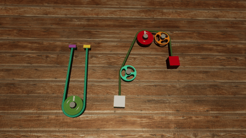

# rope

**NOTE: If you do not know the answer, choose RANDOMLY!!!!**

**NOTE: Correct choices may be one or more!!**

**There is no need for you to answer all.**

## 350

**01080**
How many purple objects are there in the video?

**01081**
Is the mass of the red cube greater than that of the cyan sphere?

**01082**
If the cyan sphere were much heavier, which direction would the blue pulley move?
A. Down
B. Up
C. Stationary

**01083**
Which of the following would happen if the brown cube were much heavier?
A. The purple pulley would not move
B. The brown pulley would not rotate
C. The purple pulley would rotate clockwise

----

## 351

**01720**
Is there any pink hollow pulley in the video?

**01721**
Is the tension of the red rope less than that of the red rope?

**01722**
If the white sphere were much heavier, which of the following would happen?
A. The orange hollow pulley would rotate anti-clockwise
B. The blue pulley would rotate anti-clockwise
C. The cyan cube would move up

**01723**
What can we do to let the blue pulley to rotate clockwise?
A. Increase the mass of the white sphere
B. Increase the mass of the cyan cube
C. Decrease the mass of the white sphere
D. Decrease the mass of the cyan cube

----

## 352

**00384**
Is the mass of the orange cube equal to that of the pink sphere?

**00385**
Is the tension of the white rope less than that of the white rope?

**00386**
If we want the orange cube to move down, what can we do?
A. Increase the mass of the pink sphere
B. Decrease the mass of the pink sphere
C. Decrease the mass of the orange cube

**00387**
If the orange cube were much lighter, which direction would the pink pulley move?
A. Stationary
B. Down
C. Up

----

## 353

**00312**
How many cubes are there in the video?

**00313**
Is the tension of the purple rope equal to that of the purple rope?

**00314**
Which direction would the blue solid pulley rotate if the pink sphere were much lighter?
A. Clockwise
B. Stationary
C. Anti-clockwise

**00315**
If we want the green pulley to rotate clockwise, what can we do?
A. Decrease the mass of the blue cube
B. Decrease the mass of the pink sphere
C. Increase the mass of the pink sphere

----

## 354

**00944**
Is there any green cube in the video?

**00945**
How many ropes are there in the video?

**00946**
If the white cube were much heavier, which direction would the yellow pulley rotate?
A. Clockwise
B. Stationary
C. Anti-clockwise

**00947**
If the brown cube were much heavier, which of the following would happen?
A. The yellow pulley would move up
B. The purple pulley would move down
C. The brown pulley would move up
D. The purple pulley would not move

----

## 355

**01628**
Is the mass of the gray sphere greater than that of the yellow cube?

**01629**
How many purple objects are there in the video?

**01630**
Which direction would the blue pulley rotate if the yellow cube were much lighter?
A. Stationary
B. Anti-clockwise
C. Clockwise

**01631**
If we want the yellow cube to move down, what can we do?
A. Decrease the mass of the gray sphere
B. Decrease the mass of the yellow cube
C. Increase the mass of the yellow cube
D. Increase the mass of the gray sphere

----

## 356

**01528**
Is there any purple rope in the video?

**01529**
Is the mass of the pink cube equal to that of the yellow cube?

**01530**
Which of the following would happen if the yellow cube were much lighter?
A. The white pulley would rotate anti-clockwise
B. The brown pulley would move down
C. The purple pulley would not rotate
D. The pink pulley would move up
E. The purple pulley would move down

**01531**
What can we do to let the white pulley to rotate anti-clockwise?
A. Decrease the mass of the brown cube
B. Increase the mass of the yellow cube
C. Increase the mass of the pink cube

----

## 357

**00180**
How many green objects are there in the video?

**00181**
Is the mass of the yellow cube less than half that of the green cube?

**00182**
If the yellow cube were much lighter, which direction would the red pulley rotate?
A. Clockwise
B. Stationary
C. Anti-clockwise

**00183**
If the green cube were much heavier, which of the following would happen?
A. The yellow cube would move down
B. The pink pulley would move down
C. The cyan pulley would rotate clockwise

----

## 358

**00060**
Is the tension of the green rope equal to half that of the black rope?

**00061**
Is there any orange fixed point in the video?

**00062**
Which direction would the orange pulley rotate if the green sphere were much heavier?
A. Stationary
B. Clockwise
C. Anti-clockwise

**00063**
If the blue cube were much heavier, what would happen?
A. The blue sphere would move down
B. The yellow hollow pulley would move down
C. The pink pulley would not rotate

----

## 359

**00740**
How many pulleys are there in the video?

**00741**
Is the tension of the green rope equal to twice that of the black rope?

**00742**
If the yellow sphere were much lighter, which of the following would happen?
A. The pink pulley would rotate anti-clockwise
B. The blue pulley would not rotate
C. The red sphere would move up
D. The red sphere would move down
E. The green pulley would rotate anti-clockwise

**00743**
If the red sphere were much lighter, which direction would the green pulley rotate?
A. Stationary
B. Anti-clockwise
C. Clockwise

----

## 360

**00340**
How many ropes are there in the video?

**00341**
Is the tension of the purple rope less than that of the purple rope?

**00342**
If the pink sphere were much heavier, which of the following would happen?
A. The pink cube would move up
B. The pink cube would move down
C. The pink sphere would move up
D. The red pulley would rotate clockwise
E. The purple pulley would move down

**00343**
If we want the pink cube to move down, what can we do?
A. Increase the mass of the pink cube
B. Decrease the mass of the pink cube
C. Decrease the mass of the pink sphere

----

## 361

**00988**
Is the tension of the pink rope equal to that of the red rope?

**00989**
How many cubes are there in the video?

**00990**
Which direction would the purple pulley move if the orange sphere were much heavier?
A. Up
B. Down
C. Stationary

**00991**
Which of the following would happen if the gray cube were much lighter?
A. The gray solid pulley would rotate anti-clockwise
B. The gray cube would move up
C. The orange sphere would move down
D. The gray solid pulley would not rotate
E. The gray hollow pulley would not rotate

----

## 362

**01660**
Is the mass of the gray cube equal to that of the green sphere?

**01661**
Is there any brown hollow pulley in the video?

**01662**
Which direction would the yellow pulley move if the gray cube were much heavier?
A. Up
B. Down
C. Stationary

**01663**
What would happen if the green sphere were much heavier?
A. The green sphere would move down
B. The orange cube would move up
C. The brown hollow pulley would not rotate
D. The brown solid pulley would rotate clockwise

----

## 363

**01580**
How many brown objects are there in the video?

**01581**
Is the mass of the gray sphere equal to that of the cyan cube?

**01582**
If the gray sphere were much heavier, which direction would the red pulley rotate?
A. Stationary
B. Anti-clockwise
C. Clockwise

**01583**
What would happen if the cyan cube were much lighter?
A. The yellow pulley would move up
B. The green pulley would not rotate
C. The purple pulley would move down
D. The green pulley would rotate clockwise

----

## 364

**00240**
Is there any black hollow pulley in the video?

**00241**
Is the mass of the red cube greater than that of the green cube?

**00242**
Which direction would the green cube move if the red cube were much heavier?
A. Stationary
B. Down
C. Up

**00243**
If we want the green cube to move down, what can we do?
A. Increase the mass of the red cube
B. Decrease the mass of the red cube
C. Increase the mass of the green cube
D. Decrease the mass of the green cube

----

## 365

**00888**
Is the tension of the yellow rope less than that of the yellow rope?

**00889**
How many pulleys are there in the video?

**00890**
Which of the following would happen if the green sphere were much heavier?
A. The cyan pulley would rotate anti-clockwise
B. The red pulley would move up
C. The cyan pulley would rotate clockwise

**00891**
Which direction would the green sphere move if the pink cube were much heavier?
A. Up
B. Down
C. Stationary

----

## 366

**00772**
Is the mass of the cyan cube greater than that of the red cube?

**00773**
How many green objects are there in the video?

**00774**
If we want the cyan cube to move down, what can we do?
A. Increase the mass of the cyan cube
B. Decrease the mass of the white cube
C. Decrease the mass of the cyan cube
D. Increase the mass of the white cube

**00775**
What would happen if the red cube were much lighter?
A. The white pulley would not rotate
B. The yellow pulley would not move
C. The cyan cube would move down

----

## 367

**01440**
Is the tension of the white rope greater than half that of the blue rope?

**01441**
How many cyan objects are there in the video?

**01442**
If we want the white pulley to rotate anti-clockwise, what can we do?
A. Decrease the mass of the blue cube
B. Increase the mass of the blue cube
C. Increase the mass of the cyan cube

**01443**
Which direction would the white pulley move if the blue cube were much lighter?
A. Stationary
B. Down
C. Up

----

## 368

**01372**
Is the mass of the cyan cube less than that of the red sphere?

**01373**
Is there any purple solid pulley in the video?

**01374**
If the white sphere were much lighter, which direction would the purple solid pulley move?
A. Stationary
B. Down
C. Up

**01375**
Which of the following would happen if the cyan cube were much lighter?
A. The white pulley would rotate anti-clockwise
B. The white pulley would rotate clockwise
C. The purple hollow pulley would not rotate

----

## 369

**01996**
Is the mass of the yellow sphere greater than that of the blue sphere?

**01997**
Is the tension of the cyan rope equal to that of the cyan rope?

**01998**
If the yellow sphere were much lighter, which direction would the blue sphere move?
A. Down
B. Up
C. Stationary

**01999**
If we want the yellow sphere to move down, what can we do?
A. Decrease the mass of the blue sphere
B. Increase the mass of the yellow sphere
C. Decrease the mass of the gray cube
D. Increase the mass of the gray cube
E. Increase the mass of the blue sphere

----

## 370

**01616**
How many green objects are there in the video?

**01617**
Is there any yellow rope in the video?

**01618**
If the cyan cube were much heavier, what would happen?
A. The white cube would move down
B. The yellow solid pulley would rotate clockwise
C. The brown hollow pulley would not move

**01619**
If the white cube were much heavier, which direction would the brown solid pulley rotate?
A. Clockwise
B. Anti-clockwise
C. Stationary

----

## 371

**00288**
How many blue objects are there in the video?

**00289**
Is the mass of the red cube less than that of the white cube?

**00290**
What can we do to let the red cube to move up?
A. Increase the mass of the white cube
B. Decrease the mass of the white cube
C. Decrease the mass of the red cube
D. Increase the mass of the red cube

**00291**
If the white cube were much lighter, which of the following would happen?
A. The red cube would move up
B. The red pulley would move down
C. The red cube would move down

----

## 372

**00924**
Is there any purple hollow pulley in the video?

**00925**
How many white objects are there in the video?

**00926**
What can we do to let the gray pulley to rotate clockwise?
A. Increase the mass of the red cube
B. Decrease the mass of the red sphere
C. Decrease the mass of the red cube

**00927**
If the red cube were much lighter, which direction would the gray pulley move?
A. Stationary
B. Up
C. Down

----

## 373

**00832**
How many solid pulleys are there in the video?

**00833**
Is there any black sphere in the video?

**00834**
What would happen if the yellow cube were much lighter?
A. The yellow cube would move up
B. The orange hollow pulley would not rotate
C. The orange solid pulley would rotate anti-clockwise

**00835**
Which direction would the red pulley rotate if the yellow cube were much heavier?
A. Clockwise
B. Stationary
C. Anti-clockwise

----

## 374

**01488**
How many orange objects are there in the video?

**01489**
Is the mass of the blue cube less than that of the white sphere?

**01490**
If the white sphere were much lighter, which direction would the yellow pulley move?
A. Up
B. Stationary
C. Down

**01491**
What can we do to let the blue cube to move up?
A. Decrease the mass of the blue cube
B. Increase the mass of the blue cube
C. Increase the mass of the gray sphere
D. Increase the mass of the white sphere
E. Decrease the mass of the white sphere

----

## 375

**00148**
How many orange objects are there in the video?

**00149**
Is there any gray solid pulley in the video?

**00150**
What can we do to let the brown pulley to rotate clockwise?
A. Decrease the mass of the yellow cube
B. Decrease the mass of the yellow sphere
C. Increase the mass of the yellow sphere

**00151**
If the yellow cube were much heavier, which of the following would happen?
A. The brown pulley would move down
B. The cyan pulley would rotate clockwise
C. The cyan pulley would rotate anti-clockwise
D. The yellow cube would move down
E. The orange pulley would rotate clockwise

----

## 376

**00036**
How many spheres are there in the video?

**00037**
Is there any black fixed point in the video?

**00038**
Which direction would the pink pulley rotate if the yellow cube were much lighter?
A. Clockwise
B. Stationary
C. Anti-clockwise

**00039**
If the white sphere were much lighter, what would happen?
A. The white pulley would not rotate
B. The yellow cube would move down
C. The white sphere would move down
D. The green sphere would not move

----

## 377

**00712**
Is the mass of the white sphere greater than that of the orange cube?

**00713**
Is the tension of the blue rope equal to that of the black rope?

**00714**
If the white sphere were much heavier, which direction would the white sphere move?
A. Up
B. Stationary
C. Down

**00715**
If we want the yellow solid pulley to move down, what can we do?
A. Increase the mass of the orange cube
B. Increase the mass of the white sphere
C. Decrease the mass of the white sphere
D. Decrease the mass of the orange cube
E. Increase the mass of the purple sphere

----

## 378

**00612**
Is there any cyan sphere in the video?

**00613**
How many pulleys are there in the video?

**00614**
Which of the following would happen if the gray cube were much heavier?
A. The cyan pulley would move down
B. The pink pulley would move down
C. The brown dynamic pulley would move up

**00615**
If the gray cube were much heavier, which direction would the cyan pulley rotate?
A. Clockwise
B. Anti-clockwise
C. Stationary

----

## 379

**01308**
Is the tension of the white rope greater than that of the black rope?

**01309**
How many fixed points are there in the video?

**01310**
What would happen if the white cube were much lighter?
A. The gray pulley would move up
B. The gray pulley would not rotate
C. The orange pulley would not rotate

**01311**
If the brown sphere were much heavier, which direction would the white cube move?
A. Stationary
B. Down
C. Up

----

