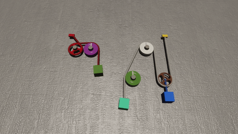

# rope

**NOTE: If you do not know the answer, choose RANDOMLY!!!!**

**NOTE: Correct choices may be one or more!!**

**There is no need for you to answer all.**

## 350

**01080**

Is the mass of the cyan sphere greater than that of the brown sphere?

**01081**

Is there any orange rope in the video?

**01082**

If we want the red pulley to rotate anti-clockwise, what can we do?

A. Decrease the mass of the cyan sphere

B. Decrease the mass of the brown cube

C. Decrease the mass of the red cube

D. Increase the mass of the red cube

E. Decrease the mass of the brown sphere

**01083**

If the brown cube were much lighter, which direction would the blue pulley move?

A. Down

B. Up

C. Stationary

----

## 351

**01720**

How many cubes are there in the video?

**01721**

How many purple objects are there in the video?

**01722**

What would happen if the cyan cube were much lighter?

A. The white pulley would rotate anti-clockwise

B. The orange solid pulley would not rotate

C. The white pulley would move down

D. The blue pulley would rotate anti-clockwise

E. The pink pulley would rotate anti-clockwise

**01723**

If we want the cyan cube to move up, what can we do?

A. Decrease the mass of the cyan cube

B. Increase the mass of the white sphere

C. Increase the mass of the cyan cube

D. Decrease the mass of the white sphere

----

## 352

**00384**

Is there any pink hollow pulley in the video?

**00385**

Is the mass of the orange cube equal to that of the pink sphere?

**00386**

If we want the brown pulley to rotate clockwise, what can we do?

A. Increase the mass of the orange cube

B. Decrease the mass of the pink sphere

C. Decrease the mass of the orange cube

**00387**

If the pink sphere were much heavier, which direction would the yellow pulley move?

A. Up

B. Stationary

C. Down

----

## 353

**00312**

Is the mass of the pink sphere greater than that of the blue cube?

**00313**

Is there any brown fixed point in the video?

**00314**

What can we do to let the blue cube to move up?

A. Increase the mass of the blue cube

B. Increase the mass of the pink sphere

C. Decrease the mass of the blue cube

D. Decrease the mass of the pink sphere

**00315**

If the pink sphere were much heavier, which direction would the green pulley rotate?

A. Stationary

B. Anti-clockwise

C. Clockwise

----

## 354

**00944**

Is the tension of the purple rope greater than that of the green rope?

**00945**

How many red objects are there in the video?

**00946**

If the brown cube were much heavier, which of the following would happen?

A. The purple pulley would not move

B. The brown pulley would not rotate

C. The brown pulley would move down

D. The pink pulley would not move

**00947**

Which direction would the pink cube move if the pink cube were much lighter?

A. Down

B. Up

C. Stationary

----

## 355

**01628**

How many yellow objects are there in the video?

**01629**

Is the mass of the yellow cube greater than that of the gray sphere?

**01630**

What can we do to let the yellow cube to move down?

A. Increase the mass of the yellow cube

B. Decrease the mass of the yellow cube

C. Increase the mass of the gray sphere

D. Decrease the mass of the gray sphere

**01631**

What would happen if the gray sphere were much heavier?

A. The yellow cube would move up

B. The blue pulley would rotate clockwise

C. The green pulley would move down

----

## 356

**01528**

Is the mass of the brown cube less than that of the pink cube?

**01529**

Is there any green rope in the video?

**01530**

If the yellow cube were much heavier, which of the following would happen?

A. The purple pulley would not rotate

B. The brown cube would move down

C. The yellow cube would move down

D. The pink cube would move up

E. The brown pulley would not rotate

**01531**

If the pink cube were much lighter, which direction would the purple pulley move?

A. Down

B. Stationary

C. Up

----

## 357

**00180**

How many spheres are there in the video?

**00181**

How many green objects are there in the video?

**00182**

Which direction would the pink pulley rotate if the green cube were much heavier?

A. Clockwise

B. Anti-clockwise

C. Stationary

**00183**

Which of the following would happen if the green cube were much lighter?

A. The pink pulley would move up

B. The pink pulley would rotate clockwise

C. The pink pulley would rotate anti-clockwise

D. The cyan pulley would not move

E. The green pulley would move down

----

## 358

**00060**

Is there any gray sphere in the video?

**00061**

Is the tension of the blue rope greater than that of the green rope?

**00062**

Which direction would the yellow solid pulley rotate if the blue sphere were much heavier?

A. Stationary

B. Anti-clockwise

C. Clockwise

**00063**

If the blue cube were much lighter, what would happen?

A. The green pulley would not move

B. The gray sphere would move up

C. The orange pulley would not move

D. The gray sphere would move down

----

## 359

**00740**

Is there any cyan hollow pulley in the video?

**00741**

How many cubes are there in the video?

**00742**

What can we do to let the yellow sphere to move down?

A. Decrease the mass of the red sphere

B. Increase the mass of the yellow sphere

C. Decrease the mass of the yellow sphere

D. Increase the mass of the red sphere

**00743**

Which direction would the green pulley move if the red sphere were much lighter?

A. Stationary

B. Up

C. Down

----

## 360

**00340**

Is the mass of the pink sphere less than that of the pink cube?

**00341**

How many ropes are there in the video?

**00342**

If the pink cube were much lighter, which of the following would happen?

A. The orange pulley would move down

B. The green pulley would not move

C. The purple pulley would move down

D. The pink cube would move up

E. The orange pulley would rotate clockwise

**00343**

If we want the red pulley to rotate clockwise, what can we do?

A. Increase the mass of the pink sphere

B. Decrease the mass of the pink sphere

C. Decrease the mass of the pink cube

D. Increase the mass of the pink cube

----

## 361

**00988**

Is there any purple solid pulley in the video?

**00989**

How many cubes are there in the video?

**00990**

What can we do to let the gray cube to move down?

A. Decrease the mass of the blue sphere

B. Decrease the mass of the gray cube

C. Increase the mass of the orange sphere

D. Increase the mass of the blue sphere

E. Increase the mass of the gray cube

**00991**

If the green sphere were much lighter, which direction would the gray cube move?

A. Stationary

B. Down

C. Up

----

## 362

**01660**

How many solid pulleys are there in the video?

**01661**

How many white objects are there in the video?

**01662**

If we want the yellow pulley to rotate anti-clockwise, what can we do?

A. Increase the mass of the gray cube

B. Decrease the mass of the orange cube

C. Increase the mass of the green sphere

**01663**

Which of the following would happen if the green sphere were much lighter?

A. The purple sphere would move down

B. The cyan pulley would move down

C. The yellow pulley would rotate clockwise

D. The orange cube would move down

----

## 363

**01580**

How many ropes are there in the video?

**01581**

How many blue objects are there in the video?

**01582**

If the cyan cube were much heavier, which direction would the purple pulley rotate?

A. Clockwise

B. Stationary

C. Anti-clockwise

**01583**

If the gray sphere were much lighter, which of the following would happen?

A. The purple pulley would rotate anti-clockwise

B. The cyan cube would move down

C. The red pulley would not rotate

----

## 364

**00240**

Is the mass of the green cube greater than that of the red cube?

**00241**

How many blue objects are there in the video?

**00242**

What would happen if the red cube were much lighter?

A. The purple pulley would not move

B. The green cube would move down

C. The yellow pulley would rotate clockwise

D. The blue pulley would move down

E. The red cube would move up

**00243**

What can we do to let the yellow pulley to rotate clockwise?

A. Increase the mass of the green cube

B. Decrease the mass of the red cube

C. Increase the mass of the red cube

D. Decrease the mass of the green cube

----

## 365

**00888**

Is there any purple fixed point in the video?

**00889**

Is the mass of the pink cube less than that of the green sphere?

**00890**

If we want the red pulley to rotate clockwise, what can we do?

A. Decrease the mass of the green sphere

B. Increase the mass of the green sphere

C. Decrease the mass of the pink cube

D. Increase the mass of the pink cube

**00891**

If the pink cube were much heavier, which of the following would happen?

A. The cyan pulley would rotate anti-clockwise

B. The green sphere would move down

C. The gray pulley would rotate clockwise

D. The red pulley would rotate anti-clockwise

----

## 366

**00772**

How many green objects are there in the video?

**00773**

How many ropes are there in the video?

**00774**

What can we do to let the pink pulley to rotate clockwise?

A. Increase the mass of the white cube

B. Decrease the mass of the cyan cube

C. Increase the mass of the red cube

**00775**

If the cyan cube were much heavier, which direction would the pink pulley move?

A. Up

B. Stationary

C. Down

----

## 367

**01440**

How many spheres are there in the video?

**01441**

How many gray objects are there in the video?

**01442**

Which direction would the red pulley rotate if the cyan cube were much lighter?

A. Stationary

B. Clockwise

C. Anti-clockwise

**01443**

If we want the brown pulley to rotate anti-clockwise, what can we do?

A. Decrease the mass of the cyan cube

B. Increase the mass of the cyan cube

C. Increase the mass of the blue cube

D. Increase the mass of the green cube

E. Decrease the mass of the blue cube

----

## 368

**01372**

Is the mass of the red sphere less than that of the white sphere?

**01373**

How many yellow objects are there in the video?

**01374**

If the red sphere were much lighter, which of the following would happen?

A. The purple solid pulley would not rotate

B. The red sphere would move down

C. The white pulley would rotate clockwise

**01375**

If the red sphere were much heavier, which direction would the purple hollow pulley rotate?

A. Anti-clockwise

B. Clockwise

C. Stationary

----

## 369

**01996**

Is the mass of the yellow sphere less than that of the blue sphere?

**01997**

How many purple objects are there in the video?

**01998**

If the blue sphere were much heavier, which direction would the yellow sphere move?

A. Up

B. Stationary

C. Down

**01999**

What can we do to let the blue sphere to move down?

A. Increase the mass of the blue sphere

B. Decrease the mass of the blue sphere

C. Increase the mass of the yellow sphere

D. Decrease the mass of the gray cube

----

## 370

**01616**

Is there any white sphere in the video?

**01617**

How many hollow pulleys are there in the video?

**01618**

If we want the white cube to move down, what can we do?

A. Increase the mass of the white cube

B. Decrease the mass of the cyan cube

C. Decrease the mass of the white cube

**01619**

If the white cube were much lighter, what would happen?

A. The white cube would move up

B. The cyan cube would move down

C. The yellow solid pulley would not rotate

----

## 371

**00288**

How many gray objects are there in the video?

**00289**

Is the mass of the white cube equal to that of the red cube?

**00290**

Which direction would the red pulley rotate if the white cube were much lighter?

A. Clockwise

B. Anti-clockwise

C. Stationary

**00291**

If we want the red cube to move up, what can we do?

A. Increase the mass of the red cube

B. Decrease the mass of the red cube

C. Increase the mass of the white cube

----

## 372

**00924**

How many fixed points are there in the video?

**00925**

How many pink objects are there in the video?

**00926**

If the red sphere were much lighter, which of the following would happen?

A. The orange pulley would move up

B. The white pulley would move down

C. The gray pulley would not move

D. The gray pulley would rotate clockwise

**00927**

If we want the red sphere to move up, what can we do?

A. Increase the mass of the red sphere

B. Decrease the mass of the red cube

C. Increase the mass of the red cube

D. Decrease the mass of the red sphere

----

## 373

**00832**

Is the tension of the red rope less than half that of the cyan rope?

**00833**

Is the mass of the yellow cube greater than twice that of the pink sphere?

**00834**

If we want the yellow cube to move up, what can we do?

A. Decrease the mass of the yellow cube

B. Increase the mass of the pink sphere

C. Increase the mass of the yellow cube

**00835**

Which direction would the red pulley move if the yellow cube were much lighter?

A. Down

B. Up

C. Stationary

----

## 374

**01488**

Is the mass of the white sphere less than that of the blue cube?

**01489**

Is the tension of the green rope greater than that of the yellow rope?

**01490**

If we want the blue cube to move down, what can we do?

A. Decrease the mass of the gray sphere

B. Increase the mass of the blue cube

C. Decrease the mass of the white sphere

D. Decrease the mass of the blue cube

**01491**

Which direction would the gray sphere move if the gray sphere were much heavier?

A. Down

B. Stationary

C. Up

----

## 375

**00148**

How many cyan objects are there in the video?

**00149**

How many spheres are there in the video?

**00150**

Which direction would the brown pulley rotate if the yellow sphere were much lighter?

A. Clockwise

B. Stationary

C. Anti-clockwise

**00151**

If the yellow cube were much heavier, which of the following would happen?

A. The yellow sphere would move down

B. The orange pulley would not move

C. The brown pulley would rotate anti-clockwise

D. The yellow pulley would rotate clockwise

----

## 376

**00036**

Is there any green rope in the video?

**00037**

How many purple objects are there in the video?

**00038**

If the gray cube were much heavier, what would happen?

A. The cyan pulley would rotate clockwise

B. The pink pulley would not move

C. The pink pulley would rotate anti-clockwise

D. The gray cube would move down

**00039**

If we want the yellow cube to move down, what can we do?

A. Decrease the mass of the yellow cube

B. Decrease the mass of the green sphere

C. Decrease the mass of the white sphere

D. Decrease the mass of the gray cube

E. Increase the mass of the yellow cube

----

## 377

**00712**

How many orange objects are there in the video?

**00713**

Is there any gray solid pulley in the video?

**00714**

Which direction would the purple sphere move if the orange cube were much heavier?

A. Up

B. Down

C. Stationary

**00715**

What can we do to let the yellow solid pulley to rotate clockwise?

A. Increase the mass of the white sphere

B. Increase the mass of the purple sphere

C. Increase the mass of the orange cube

----

## 378

**00612**

Is the mass of the gray sphere greater than half that of the gray cube?

**00613**

Is there any yellow sphere in the video?

**00614**

What can we do to let the gray sphere to move up?

A. Decrease the mass of the red cube

B. Increase the mass of the gray sphere

C. Increase the mass of the gray cube

D. Increase the mass of the red cube

**00615**

If the gray cube were much heavier, which direction would the red pulley move?

A. Down

B. Stationary

C. Up

----

## 379

**01308**

Is there any blue sphere in the video?

**01309**

Is the mass of the green sphere less than that of the brown sphere?

**01310**

If we want the orange pulley to rotate anti-clockwise, what can we do?

A. Decrease the mass of the white cube

B. Increase the mass of the green sphere

C. Increase the mass of the brown sphere

D. Increase the mass of the white cube

E. Decrease the mass of the green sphere

**01311**

If the brown sphere were much lighter, which direction would the gray pulley move?

A. Stationary

B. Up

C. Down

----

