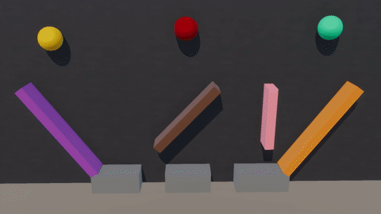

# soft

**NOTE: If you do not know the answer, choose RANDOMLY!!!!**

**NOTE: Correct choices may be one or more!!**

**There is no need for you to answer all.**

## 350

**00810**
Is the plasticity of the brown ball much greater than the red ball?

**00811**
If we removed the blue floating wall and other balls, which pit would the green ball drop into?
A. The left pit
B. The right pit
C. None of the above

**00812**
Will the red ball finally drop into the right pit?
A. Yes
B. No
C. Can not answer

----

## 351

**01290**
Is the plasticity of the red ball much greater than the orange ball?

**01291**
Will the orange ball finally drop into the left pit?
A. Yes
B. No
C. Can not answer

**01292**
If we removed the orange floating wall and other balls, which pit would the orange ball drop into?
A. The left pit
B. The right pit
C. None of the above

----

## 352

**00288**
Is the elasticity of the red ball much less than the brown ball?

**00289**
If we removed the white floating wall and other balls, which pit would the brown ball drop into?
A. The left pit
B. The right pit
C. None of the above

**00290**
What can we do to make the brown ball drop into the left pit?
A. Remove the orange floating wall and other balls.
B. Remove the white floating wall and other balls.
C. None of the above.

----

## 353

**00234**
Is the elasticity of the orange ball much less than the green ball?

**00235**
Will the yellow ball finally drop into the left pit?
A. Yes
B. No
C. Can not answer

**00236**
If we removed the blue floating wall and other balls, which pit would the green ball drop into?
A. The left pit
B. The right pit
C. None of the above

----

## 354

**00708**
Is the elasticity of the blue ball much less than the yellow ball?

**00709**
What can we do to make the cyan ball drop into the left pit?
A. Remove the white floating wall and other balls.
B. Remove the purple floating wall and other balls.
C. None of the above.

**00710**
If we removed the white floating wall and other balls, which pit would the cyan ball drop into?
A. The left pit
B. The right pit
C. None of the above

----

## 355

**01221**
Is the plasticity of the purple ball much greater than the green ball?

**01222**
What can we do to make the purple ball drop into the left pit?
A. Remove the cyan floating wall and other balls.
B. Remove the blue floating wall and other balls.
C. None of the above.

**01223**
Will the green ball finally drop into the left pit?
A. Yes
B. No
C. Can not answer

----

## 356

**01146**
Is the elasticity of the yellow ball much greater than the purple ball?

**01147**
Will the purple ball finally drop into the right pit?
A. Yes
B. No
C. Can not answer

**01148**
If we removed the blue floating wall and other balls, which pit would the cyan ball drop into?
A. The left pit
B. The right pit
C. None of the above

----

## 357

**00135**
Is the elasticity of the pink ball much less than the brown ball?

**00136**
If we removed the blue floating wall and other balls, which pit would the pink ball drop into?
A. The left pit
B. The right pit
C. None of the above

**00137**
What can we do to make the purple ball drop into the right pit?
A. Remove the blue floating wall and other balls
B. Remove the pink floating wall and other balls
C. None of the above

----

## 358

**00045**
Is the elasticity of the yellow ball much greater than the red ball?

**00046**
If we removed the black floating wall and other balls, which pit would the red ball drop into?
A. The left pit
B. The right pit
C. None of the above

**00047**
What can we do to make the yellow ball drop into the left pit?
A. Remove the black floating wall and other balls.
B. Remove the red floating wall and other balls.
C. None of the above.

----

## 359

**00555**
Is the elasticity of the pink ball much greater than the orange ball?

**00556**
If we removed the black floating wall and other balls, which pit would the purple ball drop into?
A. The left pit
B. The right pit
C. None of the above

**00557**
Will the orange ball finally drop into the left pit?
A. Yes
B. No
C. Can not answer

----

## 360

**00255**
Is the elasticity of the white ball much less than the yellow ball?

**00256**
What can we do to make the green ball drop into the left pit?
A. Remove the brown floating wall and other balls.
B. Remove the pink floating wall and other balls.
C. None of the above.

**00257**
Will the white ball finally drop into the right pit?
A. Yes
B. No
C. Can not answer

----

## 361

**00741**
Is the plasticity of the cyan ball much greater than the yellow ball?

**00742**
If we removed the pink floating wall and other balls, which pit would the yellow ball drop into?
A. The left pit
B. The right pit
C. None of the above

**00743**
What can we do to make the yellow ball drop into the right pit?
A. Remove the pink floating wall and other balls
B. Remove the purple floating wall and other balls
C. None of the above

----

## 362

**01245**
Is the elasticity of the brown ball much greater than the purple ball?

**01246**
If we removed the red floating wall and other balls, which pit would the purple ball drop into?
A. The left pit
B. The right pit
C. None of the above

**01247**
What can we do to make the orange ball drop into the left pit?
A. Remove the red floating wall and other balls.
B. Remove the purple floating wall and other balls.
C. None of the above.

----

## 363

**01185**
Is the plasticity of the purple ball much less than the green ball?

**01186**
Will the purple ball finally drop into the right pit?
A. Yes
B. No
C. Can not answer

**01187**
If we removed the white floating wall and other balls, which pit would the green ball drop into?
A. The left pit
B. The right pit
C. None of the above

----

## 364

**00180**
Is the plasticity of the cyan ball much greater than the orange ball?

**00181**
If we removed the cyan floating wall and other balls, which pit would the white ball drop into?
A. The left pit
B. The right pit
C. None of the above

**00182**
Will the white ball finally drop into the right pit?
A. Yes
B. No
C. Can not answer

----

## 365

**00666**
Is the plasticity of the pink ball much greater than the black ball?

**00667**
What can we do to make the pink ball drop into the right pit?
A. Remove the white floating wall and other balls
B. Remove the pink floating wall and other balls
C. None of the above

**00668**
If we removed the white floating wall and other balls, which pit would the black ball drop into?
A. The left pit
B. The right pit
C. None of the above

----

## 366

**00579**
Is the elasticity of the green ball much greater than the cyan ball?

**00580**
If we removed the black floating wall and other balls, which pit would the red ball drop into?
A. The left pit
B. The right pit
C. None of the above

**00581**
What can we do to make the cyan ball drop into the right pit?
A. Remove the black floating wall and other balls
B. Remove the white floating wall and other balls
C. None of the above

----

## 367

**01080**
Is the plasticity of the brown ball much less than the purple ball?

**01081**
If we removed the blue floating wall and other balls, which pit would the orange ball drop into?
A. The left pit
B. The right pit
C. None of the above

**01082**
Will the purple ball finally drop into the left pit?
A. Yes
B. No
C. Can not answer

----

## 368

**01029**
Is the plasticity of the green ball much less than the blue ball?

**01030**
If we removed the brown floating wall and other balls, which pit would the green ball drop into?
A. The left pit
B. The right pit
C. None of the above

**01031**
Will the green ball finally drop into the right pit?
A. Yes
B. No
C. Can not answer

----

## 369

**01497**
Is the elasticity of the orange ball much greater than the black ball?

**01498**
What can we do to make the orange ball drop into the right pit?
A. Remove the pink floating wall and other balls
B. Remove the brown floating wall and other balls
C. None of the above

**01499**
If we removed the pink floating wall and other balls, which pit would the white ball drop into?
A. The left pit
B. The right pit
C. None of the above

----

## 370

**01212**
Is the plasticity of the red ball much less than the cyan ball?

**01213**
Will the yellow ball finally drop into the left pit?
A. Yes
B. No
C. Can not answer

**01214**
If we removed the pink floating wall and other balls, which pit would the yellow ball drop into?
A. The left pit
B. The right pit
C. None of the above

----

## 371

**00216**
Is the plasticity of the black ball much less than the green ball?

**00217**
What can we do to make the black ball drop into the left pit?
A. Remove the cyan floating wall and other balls.
B. Remove the white floating wall and other balls.
C. None of the above.

**00218**
Will the cyan ball finally drop into the left pit?
A. Yes
B. No
C. Can not answer

----

## 372

**00693**
Is the elasticity of the blue ball much less than the green ball?

**00694**
Will the blue ball finally drop into the right pit?
A. Yes
B. No
C. Can not answer

**00695**
What can we do to make the yellow ball drop into the left pit?
A. Remove the yellow floating wall and other balls.
B. Remove the green floating wall and other balls.
C. None of the above.

----

## 373

**00624**
Is the elasticity of the black ball much less than the blue ball?

**00625**
Will the pink ball finally drop into the left pit?
A. Yes
B. No
C. Can not answer

**00626**
If we removed the yellow floating wall and other balls, which pit would the black ball drop into?
A. The left pit
B. The right pit
C. None of the above

----

## 374

**01116**
Is the plasticity of the red ball much greater than the black ball?

**01117**
Will the black ball finally drop into the right pit?
A. Yes
B. No
C. Can not answer

**01118**
If we removed the cyan floating wall and other balls, which pit would the black ball drop into?
A. The left pit
B. The right pit
C. None of the above

----

## 375

**00111**
Is the plasticity of the cyan ball much greater than the purple ball?

**00112**
If we removed the red floating wall and other balls, which pit would the purple ball drop into?
A. The left pit
B. The right pit
C. None of the above

**00113**
What can we do to make the purple ball drop into the left pit?
A. Remove the red floating wall and other balls.
B. Remove the blue floating wall and other balls.
C. None of the above.

----

## 376

**00027**
Is the plasticity of the blue ball much greater than the purple ball?

**00028**
What can we do to make the purple ball drop into the right pit?
A. Remove the red floating wall and other balls
B. Remove the green floating wall and other balls
C. None of the above

**00029**
If we removed the red floating wall and other balls, which pit would the purple ball drop into?
A. The left pit
B. The right pit
C. None of the above

----

## 377

**00534**
Is the elasticity of the cyan ball much greater than the purple ball?

**00535**
If we removed the red floating wall and other balls, which pit would the cyan ball drop into?
A. The left pit
B. The right pit
C. None of the above

**00536**
Will the pink ball finally drop into the right pit?
A. Yes
B. No
C. Can not answer

----

## 378

**00459**
Is the elasticity of the orange ball much less than the black ball?

**00460**
Will the orange ball finally drop into the right pit?
A. Yes
B. No
C. Can not answer

**00461**
What can we do to make the purple ball drop into the right pit?
A. Remove the red floating wall and other balls
B. Remove the white floating wall and other balls
C. None of the above

----

## 379

**00981**
Is the plasticity of the black ball much less than the blue ball?

**00982**
What can we do to make the blue ball drop into the left pit?
A. Remove the cyan floating wall and other balls.
B. Remove the black floating wall and other balls.
C. None of the above.

**00983**
If we removed the cyan floating wall and other balls, which pit would the blue ball drop into?
A. The left pit
B. The right pit
C. None of the above

----

